# NavWareSet Scene01 `online_v2` 完整技术报告

> 当前聚焦版本：Local Pure-Online 30 Hz RGB-Guided LiDAR Frustum Clustering + Causal 3D Tracking + Persistent Identity  
> 软件版本：`online_v2 2.0.0`  
> 报告依据：当前仓库真实代码、冻结资产、配置文件，以及 2026-08-29 完成的全量测试产物  
> 当前经验配准：Scene01-only `(du,dv)=(+64,+36) px`

## 1. 执行摘要

当前版本是一个面向 NavWareSet Scene01 的**纯在线、因果 RGB–LiDAR 3D 检测与跟踪系统**。它以约 30 Hz RGB 图像为输出时间轴，以约 10 Hz LiDAR 点云提供三维修正；两次 LiDAR 更新之间使用只依赖历史状态的常速度模型传播目标位置。

系统不使用 BEV-CNN。其核心路线为：

```text
30 Hz RGB
→ frozen YOLO11s PERSON/ROBOT boxes
→ 与最近过去的 10 Hz LiDAR 因果同步
→ LiDAR 变换和相机投影
→ RGB box 约束点云视锥
→ 冻结静态背景抑制
→ 自适应 Euclidean connected components
→ 选择可见目标 component 并计算 XYZ
→ 因果 3D/2D tracking
→ Frozen OSNet ReID + 持久身份状态机
→ 30 Hz 因果位置传播
→ 3D cylinder overlay
```

当前版本已完成 7,490 个 RGB 帧和 2,498 个 LiDAR 帧的全序列测试。在 RTX 4060 Laptop GPU 上，原始时间实时回放处理了全部帧，输出 29.992 Hz、丢帧为 0。三维 component 可用率为 99.550%，人物 XYZ 行有效率为 97.746%，机器人 XY 行有效率为 96.758%。

不过，完整测试也发现了明确的剩余问题：人物固定身份覆盖率为 82.493%，存在 28 次 confirmed identity → anonymous，以及 1 次 fixed G → different G。因此，该版本可以表述为**在线 3D 检测与实时运行稳定，身份连续性仍未完全通过**，不能表述为身份近乎完美。

## 2. 版本定位与结果语义

### 2.1 这个版本是什么

当前版本是一条独立的 RGB-guided geometric detection 路线：RGB 检测框提供目标类别和图像区域，LiDAR 在相应图像视锥中提供 metric 3D 点，Euclidean clustering 从候选点中形成三维 component，tracking 与 identity 模块再维护时间连续性。

它与 BEV-CNN 的关系是：

- 不加载或调用 BEV-CNN；运行日志明确记录 `bev_cnn_used=false`。
- 不读取 BEV-CNN 轨迹作为先验。
- 不使用 BEV-CNN 结果选择 cluster。
- 只使用冻结 YOLO 检测器、LiDAR 几何、冻结静态先验、OSNet ReID 和当前历史状态。

### 2.2 三维中心的真实语义

人物输出的 XYZ 是：

> `PERSON_VISIBLE_COMPONENT_CENTER`

即当前 RGB 框内被选中的**可见 LiDAR component 的稳健中心**，不是完整人体 cuboid 的几何中心，也不是由二维框反推得到的伪深度。

机器人内部聚类中心语义是：

> `ROBOT_VISIBLE_SURFACE_COMPONENT_CENTER_NOT_OFFICIAL_ORIGIN`

机器人正式输出只提供 XY。由于当前数据链没有可信的官方机器人 Z 和 yaw：

- `robot_z_available=false`；
- 不输出机器人 Z；
- 不绘制 heading arrow；
- 圆柱底面 Z 由地面平面计算，仅用于显示。

### 2.3 在线与因果的定义

本项目中的 online 指：

- 按 ROS1 bag 中消息到达顺序处理；
- 当前 LiDAR 只允许使用已经到达且时间戳不晚于它的 RGB；
- 不读取未来 RGB、未来 LiDAR 或未来 ReID 特征；
- 不做离线插值、后向平滑或历史结果改写；
- 运行时不读取 GT。

这是一种**本地 ROS1 bag 在线回放实现**，不是已经部署完成的 ROS/ROS2 实时节点。

## 3. 系统总体架构

```mermaid
flowchart LR
    RGB[30 Hz RGB] --> DET[YOLO11s PERSON / ROBOT detection]
    DET --> CACHE[当前与历史 RGB 支持缓存]
    LIDAR[10 Hz RSLiDAR] --> SYNC[因果同步<br/>RGB <= LiDAR, age <= 35 ms]
    CACHE --> SYNC
    SYNC --> PROJ[坐标变换 + K/D/T 投影<br/>Scene01 empirical +64,+36]
    PROJ --> FRUSTUM[RGB box frustum<br/>exclusive point ownership]
    FRUSTUM --> STATIC[冻结 temporal + occupancy suppression]
    STATIC --> CC[CUDA/CPU adaptive Euclidean components]
    CC --> CENTER[component selection + robust XYZ center]
    CENTER --> TRACK[10 Hz causal 3D/2D tracker]
    TRACK --> ID[Frozen OSNet ReID<br/>persistent identity manager]
    ID --> MOTION[CausalMotionBank<br/>30 Hz XY propagation]
    DET --> ASSOC[当前 RGB association]
    MOTION --> ASSOC
    ASSOC --> DISPLAY[PERSON XYZ / ROBOT XY<br/>3D cylinders + labels]
```



代码职责如下：

| 文件 | 主要职责 |
|---|---|
| `run_online.py` | 单一命令行入口、解释器引导、默认输出设置 |
| `src/online_v2/runtime.py` | 30 Hz RGB / 10 Hz LiDAR 事件流、同步、传播、关联、渲染和指标 |
| `src/online_v2/pipeline.py` | YOLO、ReID、10 Hz tracker、投影分层、聚类调用和圆柱几何 |
| `src/online_v2/support.py` | 标定常量、投影、静态先验、CPU/CUDA 聚类、component 评分、OSNet |
| `src/online_v2/identity.py` | 持久身份锁、有限记忆、运动+外观恢复和冲突控制 |
| `src/online_v2/recovery.py` | occupancy 删除点的严格因果恢复判定 |
| `src/online_v2/registration.py` | raw physical projection 残差旁路审核，不写回推理 |

## 4. 输入、冻结资产与数据边界

### 4.1 传感器输入

默认数据源为：

```text
D:\detection\01_grs\1_grs.bag
```

核心话题为 RGB 图像和 `/rslidar_points`。完整 Scene01 包含：

| 数据 | 数量 | 频率 |
|---|---:|---:|
| RGB | 7,490 帧 | 29.987 Hz |
| LiDAR | 2,498 帧 | 10.000 Hz |
| 传感器时长 | 249.741 s | — |

默认运行只读取 TRAIN_FIT：2,937 RGB / 979 LiDAR。只有显式指定 `--allow-full-sequence` 才允许读取完整 Scene01，包括 VALIDATION、TEST 和 EMBARGO。

### 4.2 冻结资产

| 资产 | 用途 | 约束 |
|---|---|---|
| `best_detector_fasttrack.pt` | YOLO11s PERSON/ROBOT detector | 运行时只推理 |
| `osnet_x1_0_msmt17_combineall.pth` | OSNet ReID backbone | 冻结权重 |
| `trainfit_fixed_identity_prototypes.npz` | G01–G05 ReID prototypes | `TRAIN_FIT_ONLY` |
| `temporal_background_full_trainfit979.npz` | temporal static voxels | 979 个 TRAIN_FIT LiDAR 帧冻结 |
| `1_occupancy_xy_points.json` | occupancy proximity prior | 冻结读取 |

ReID prototype 的维度为 704，包含五个固定身份；样本数分别为 G01 782、G02 594、G03 1,232、G04 934、G05 905。加载时会验证 `fit_scope=TRAIN_FIT_ONLY`。

Temporal background 使用 0.12 m voxel、0.65 出现频率阈值，共 11,244 个冻结静态 voxel；配置明确记录 validation updates = 0、test updates = 0，并校验 NPZ SHA256。

## 5. RGB 二维检测

### 5.1 检测器

RGB 分支使用冻结的 YOLO11s 派生模型 `best_detector_fasttrack.pt`。实际推理参数为：

| 参数 | 数值 |
|---|---:|
| 输入尺寸 `imgsz` | 960 |
| confidence threshold | 0.30 |
| NMS IoU | 0.60 |
| `max_det` | 12 |
| 类别 | PERSON=0，ROBOT=1 |

检测器每个 RGB 帧运行一次。全序列实时测试中，YOLO 耗时为 12.975 ms mean、15.962 ms P95、117.404 ms max。

### 5.2 二维框的作用

二维框不直接产生深度。它有四个作用：

1. 确定目标类别 PERSON/ROBOT；
2. 限制 LiDAR 点的相机视锥；
3. 帮助从多个 Euclidean component 中选择与目标最一致的 component；
4. 在 30 Hz RGB 帧上，将历史 3D 状态重新关联到当前可见目标。

当前 30 Hz 正式渲染不画 YOLO 框，只画可用的 3D cylinder、身份/坐标标签和运行状态。YOLO 框仍在内部参与推理。

## 6. RGB–LiDAR 时间同步

每个 LiDAR 帧只接受：

```text
RGB timestamp <= LiDAR timestamp
LiDAR timestamp - RGB timestamp <= 35 ms
```

如果同时存在多个候选，选择时间戳最大的过去 RGB，即离当前 LiDAR 最近的历史 RGB。未来 RGB 会被显式拒绝。

完整实时测试结果：

| 指标 | 结果 |
|---|---:|
| matched LiDAR updates | 2,498 / 2,498 |
| unmatched LiDAR | 0 |
| future RGB support | 0 |
| support age mean | 18.466 ms |
| support age P95 | 33.126 ms |
| support age max | 34.995 ms |

## 7. 坐标、投影与经验像素配准

### 7.1 物理投影链

统一采用：

```text
p_target = T_target_from_source @ p_source
```

点云先从 `rslidar` 变换到 `annotated_data_product`，再变换到 camera optical frame，并通过相机内参 K 和畸变 D 使用 OpenCV `projectPoints` 投影。

相机内参为：

```text
fx = 638.7348, fy = 637.0190
cx = 631.7426, cy = 376.0455
D  = [-0.05481, 0.06478, -0.000885, -0.000277, -0.02061]
```

只有 `Z_cam > 0` 且像素位于 1280×720 图像范围内的点才可进入后续链路。

### 7.2 三条投影链必须区分

当前代码明确分为：

```text
Physical audit baseline
K + D + T, du=dv=0
→ project_physical()

Scene01 empirical inference
K + D + T, du=+64, dv=+36
→ project_inference()

Legacy visualization
K + D + T, du=+48, dv=0
→ 仅显式调试显示，默认关闭
```

重要事实：`(+64,+36)` 会参与 Scene01 的点归属、component 选择和 3D–2D association，因此它不是单纯把图形画面平移，而是 Scene01-specific empirical registration。圆柱显示另用 display-only `(+60,+17)`，不会反向改变推理结果。

它也**不是物理标定结果**。Raw `K+D+T, du=dv=0` 仍保留为 `RAW_PHYSICAL_CALIBRATION_BASELINE_NOT_PROVEN_FINAL`，而不是“已经证明正确的最终标定”。

### 7.3 `(+64,+36)` 的选择过程

偏移只在 TRAIN_FIT 上通过分阶段二维网格搜索产生：

- 水平 `du` 搜索约 44–72 px；
- 垂直 `dv` 搜索约 -4–40 px；
- 根据 TRAIN_FIT 的 F1、Recall、Precision、RMSE/P95 选择候选；
- 候选冻结后才加载 VALIDATION GT；
- TEST/EMBARGO 未参与选择或门禁。

冻结 VALIDATION 结果为：

| 投影方案 | Precision | Recall | F1 | XY RMSE | XY P95 |
|---|---:|---:|---:|---:|---:|
| Raw `(0,0)` | 0.8855 | 0.6887 | 0.7748 | 0.3666 m | 0.8852 m |
| Legacy `(+48,0)` | 0.9643 | 0.9435 | 0.9538 | 0.2592 m | 0.5784 m |
| Current `(+64,+36)` | **0.9794** | **0.9603** | **0.9697** | **0.2449 m** | **0.5705 m** |

评估采用 584 个冻结 VALIDATION LiDAR 帧、2,920 个 GT 目标、3D Hungarian 一对一匹配和 1.5 m gate。

### 7.4 为什么不能迁移到其他场景

`(+64,+36)` 混合了 Scene01 的传感器 registration residual、RGB box/component 的语义差异和该场景的可见结构。它没有证明是传感器级 K、D 或外参修正，因此：

- 不能自动迁移到 Scene28；
- 不能写回 CameraInfo；
- 不能宣称修复了物理标定；
- 新场景必须至少回到 raw physical baseline 并重新做独立 registration audit。

## 8. LiDAR 候选点筛选与静态背景抑制

### 8.1 高度门控

地面高度由冻结地面平面计算：

```text
h = n · p + d
```

当前平面参数为：

```text
n = [0.004778, -0.015885, 0.999862]
d = 2.178256
```

高度范围：

| 阶段/类别 | 高度范围 |
|---|---:|
| broad candidate | 0.03–2.15 m |
| PERSON | 0.08–2.15 m |
| ROBOT | 0.03–1.35 m |

### 8.2 冻结 temporal background

点所在 voxel 如果在 TRAIN_FIT 中以高频率出现，会被判定为静态结构并删除。此先验是只读的；VALIDATION、TEST 和运行时数据不会更新它。

### 8.3 Occupancy suppression

对于 temporal 阶段保留、但高度极低或极高的点，系统进一步检查其 XY 是否在 occupancy map 7 cm 邻域内。邻近冻结 occupancy 结构的点会被删除，以抑制墙、门框、固定设备等静态干扰。

完整序列统计：

| 点云阶段 | 点数 |
|---|---:|
| 输入点 | 69,217,167 |
| optical projection valid | 34,042,224 |
| 落入图像 | 18,058,575 |
| 高度候选 | 11,421,352 |
| temporal removed | 7,231,684 |
| occupancy removed | 1,426,153 |
| suppression 后保留 | 2,763,515 |

这些数字说明 static suppression 很强。它显著降低静态误检，但也可能误删靠墙或长期静止的人体点。

## 9. RGB-guided Euclidean clustering 与 3D 中心

### 9.1 Exclusive point ownership

所有可用 LiDAR 点投影到 RGB 后，只能属于一个 box。重叠框区域内，不复制同一个点给多个目标，而是选择归一化图像中心距离最小的 box：

```text
score = || (pixel - box_center) / (box_width, box_height) ||
```

这一设计减少同一 LiDAR component 被两个人同时使用的问题。

### 9.2 自适应 Euclidean connected components

框内点使用欧氏距离连接。连接半径随目标在 XY 平面的距离增加：

```text
r_i = 0.18 + 0.02 * ||(x_i, y_i)||  [m]
```

每个 component 至少需要 3 个点。CPU 路径使用 `cKDTree + union-find`；CUDA 路径使用 CuPy RawKernel 完成点对连接与根节点压缩。当前 RTX 4060 实测采用 CUDA geometry backend。

这不是标准固定 `eps` 的 DBSCAN：它不学习模型，也不使用 BEV tensor，而是按距离自适应的 Euclidean connected components。

### 9.3 Component 选择

一个 RGB 框内可能存在多个 component。系统计算每个 component 的稳健中心并投影回图像，然后综合：

- 投影中心与 box 内目标位置的归一化距离；
- component 过小惩罚；
- component 过大惩罚；
- 点数较多的轻微奖励。

目标像素位置不是严格 bbox center，而是：

```text
u_target = bbox horizontal center
v_target = bbox_top + 0.54 * bbox_height
```

component 评分为：

```text
normalized_center
+ 0.35 * small_size_penalty
+ 0.45 * large_size_penalty
- 0.055 * log(1 + point_count)
```

选择 score 最小的 component。

### 9.4 三维中心计算

最终中心不是所有点的算术平均，而是逐轴 5% 与 95% 分位点的中点：

```text
center = (quantile_0.05(points) + quantile_0.95(points)) / 2
```

这样可以减少孤立离群点对中心位置的影响。

### 9.5 Suppressed-point recovery

正常 suppression 后 PERSON 没有 component 时，代码可检查“被 occupancy 删除但未被 temporal 删除”的点，并施加：

- 至少 3 点；
- 投影中心仍在原 PERSON box 内；
- 三维尺寸合理；
- 不与邻近人物竞争；
- component 排名不歧义；
- 必须与该 raw track 的历史 3D 运动相容。

全序列实际触发 13 次候选，接受 0 次、拒绝 13 次。因此当前完整结果没有依赖此恢复分支捞回任何 XYZ。

## 10. 10 Hz 因果 3D/2D Tracking

### 10.1 Track-to-observation 匹配

Tracker 按类别分开匹配。若新旧观测都有 XYZ：

```text
predicted_xyz = previous_xyz + velocity * frame_gap
gate = 0.7 + 0.18 * min(frame_gap, 5)  [m]
cost = 0.75 * XY_distance/gate + 0.25 * (1 - IoU)
```

只有 XY distance 不超过 gate 的候选才能进入 Hungarian assignment。若某一侧没有 XYZ，则要求 IoU ≥ 0.1，并采用偏高的 2D-only cost。最终只接受 assignment cost ≤ 1.0。

Track 最大保留 10 个 LiDAR 更新。没有匹配的 PERSON 先尝试分配固定 G 身份，否则生成 `T0001...` 临时三维 track。ROBOT 中置信度最高且未被匹配者成为 `R1`。

### 10.2 速度估计

速度只由过去测量更新：

```text
v_t = 0.72 * v_(t-1) + 0.28 * (p_t - p_(t-1)) / dt
```

Z 方向速度强制为 0。人物 Z 在 LiDAR 更新之间保持；机器人不输出 Z。

## 11. 30 Hz 状态传播与 RGB association

LiDAR 只在 10 Hz 产生新三维测量。`CausalMotionBank` 将最后一次测量按历史速度传播到当前 RGB 时间：

```text
XY(t_rgb) = XY(t_lidar) + velocity_xy * Δt
Z_person(t_rgb) = Z_person(t_lidar)
```

预测最大时域为 180 ms。超过时域的状态会标记为不新鲜，不绘制圆柱。

每个当前 RGB 帧把传播后的 3D 中心重新投影，并与当前 YOLO box 做 Hungarian assignment。box cost 由框外距离和中心距离组成：

```text
cost = 0.7 * normalized_outside_distance
     + 0.3 * normalized_center_distance
```

接受阈值为 1.15。没有 3D 状态匹配的当前检测进入 `Anonymous2DTracker`；它只通过 IoU 维护临时 `Axxxx` 轨迹，不伪造深度或固定身份。

输出状态区分：

- `LIDAR_MEASUREMENT`：首次输出某次新 LiDAR 修正；
- `CAUSAL_PREDICTION`：从历史 LiDAR 修正传播得到。

## 12. Frozen ReID 与持久身份

### 12.1 ReID 特征

人物 crop 调整到 OSNet 输入，输出 512 维 learned feature；同时加入颜色特征，组合权重为：

```text
combined = normalize([0.7 * OSNet_feature, 1.15 * color_feature])
```

组合后得到 704 维向量。与 TRAIN_FIT 冻结 prototype 使用 cosine distance：

```text
distance = 1 - embedding · prototype
```

接受阈值为 0.48。新身份使用 Hungarian 一对一分配，不强制凑满五个人。

### 12.2 持久身份状态机

身份状态包括：

```text
ANONYMOUS
CANDIDATE
CONFIRMED
TEMPORARILY_LOST
RECOVERED
```

持续存在的 raw track 直接继承其固定身份，不在每个帧重新做 ReID。当前参数：

| 参数 | 数值 |
|---|---:|
| ReID threshold | 0.48 |
| short reservation | 1.2 s |
| recovery memory | 2.0 s |
| motion recovery gate | `min(3.0, 0.75 + 1.5*gap_s)` m |

Track 断裂后的身份恢复必须同时满足 motion compatible 和 appearance compatible。候选 cost 为：

```text
0.6 * ReID_distance / 0.48
+ 0.4 * motion_distance / motion_gate
```

只有 cost ≤ 1.0 的全局一对一 Hungarian 匹配才接受。位置相似但外观不一致、或外观相似但三维运动不可能，都保持 anonymous。

### 12.3 同帧身份冲突

如果当前 RGB association 产生同一个固定 G 的多个可见行，只保留最近 LiDAR 支持更强的一行，其余降为 anonymous。完整序列解决了 14 个此类陈旧重复冲突，最终同帧重复 fixed G 为 0。

## 13. 3D Cylinder 生成与显示

圆柱只由已经跟踪的 metric state 构造，不反向修改 XYZ：

| 类别 | 半径 | 高度 | 圆周采样 |
|---|---:|---:|---:|
| PERSON | 0.25 m | 1.70 m | 12 |
| ROBOT | 0.34 m | 0.80 m | 12 |

步骤为：

1. 使用 tracked `(x,y)`；
2. 根据冻结地面平面计算 cylinder base Z；
3. 在 3D 中生成上下两个 12 点圆环和侧边；
4. 通过 `project_display()` 投影所有 3D 顶点；
5. 只有所有顶点都具有合法正相机深度时才绘制；
6. 绘制半透明侧面、轮廓和身份/坐标标签。

当前 inference 使用 `(+64,+36)`；圆柱 display 使用 TRAIN_FIT 清晰人物样本中 cylinder-to-RGB-box 中线残差得到的 `(+60,+17)`。该值只改变渲染，不改变 point ownership、cluster、XYZ、tracking 或 identity。显式 `--legacy-display-offset` 会把显示切换为旧 `(+48,0)`。

## 14. 输出文件与审计信息

一次完整运行至少输出：

| 文件 | 内容 |
|---|---|
| `online_frames.jsonl` | 每个 RGB 帧的检测、状态、身份、XYZ/XY、时间和运行耗时 |
| `online_30hz_summary.json` / `metrics.json` | 全局计数、速率、性能、3D、identity、projection 与 gate |
| `runtime_per_frame.csv` | 逐帧运行耗时和时序数据 |
| `metrics_modules.csv` | 模块耗时分布 |
| `metrics_sync.json` | RGB–LiDAR 因果同步统计 |
| `metrics_identity.json` | 身份覆盖与状态机统计 |
| `identity_events.jsonl` | 身份确认、丢失、恢复、拒绝和冲突事件 |
| `causality_audit.json` | 无未来数据、时间戳和状态来源审计 |
| `drop_statistics.json` | 丢帧和队列统计 |
| `projection_residual_audit.json` | report-only registration 候选和门禁 |

JSONL 只追加当前结果，不回写历史帧。

## 15. 完整测试结果

### 15.1 测试环境

| 项目 | 环境 |
|---|---|
| OS | Windows 10.0.26200 |
| CPU | Intel Family 6 Model 186，20 logical CPUs |
| GPU | NVIDIA GeForce RTX 4060 Laptop GPU，8 GB |
| Driver | 566.24 |
| Python | 3.11.6 |
| PyTorch | 2.10.0+cu128 |
| CUDA runtime | 12.8 |
| Ultralytics | 8.4.115 |
| CuPy | 13.6.0 |
| Git commit | `e04de2ce49572c73feca4ff33c88d3d4e1bf5eac` |
| 工作区 | dirty，报告对应当前未提交工作树 |

### 15.2 自动测试

```text
54 passed in 6.66 s
```

覆盖内容包括编译、投影链隔离、经验偏移、因果同步、时间戳、点云解码、CUDA/CPU 行为、tracking、identity、suppressed recovery 和默认数据范围。

### 15.3 全量无节流与实时回放

| 指标 | 无节流 | 原始时间实时 |
|---|---:|---:|
| RGB processed | 7,490 / 7,490 | 7,490 / 7,490 |
| LiDAR updates | 2,498 / 2,498 | 2,498 / 2,498 |
| backlog drops | 0 | 0 |
| output rate | 36.461 FPS | 29.992 Hz |
| wall duration | 205.426 s | 249.729 s |
| sensor duration | 249.741 s | 249.741 s |
| all runtime gates | PASS | PASS |

两次运行的 7,490 帧检测、三维状态、tracking 和 identity 核心字段逐帧比较，语义不一致帧数为 0。

### 15.4 三维覆盖

| 指标 | 结果 |
|---|---:|
| LiDAR detections | 14,459 |
| components / measurements | 14,394 |
| component availability | 99.550% |
| PERSON measurements | 11,945 |
| ROBOT measurements | 2,449 |
| PERSON rows | 35,894 |
| PERSON XYZ valid | 35,085（97.746%） |
| ROBOT rows | 7,433 |
| ROBOT XY valid | 7,192（96.758%） |
| ROBOT XYZ valid | 0（按定义不可用） |

### 15.5 身份结果

| 指标 | 结果 |
|---|---:|
| PERSON fixed-ID rows | 29,610 |
| PERSON anonymous rows | 6,284 |
| fixed-ID coverage | 82.493% |
| initial confirmations | 8 |
| recovery attempts | 362 |
| recovery accepted / rejected | 44 / 318 |
| temporarily lost events | 90 |
| short-occlusion retained rows | 42 |
| same-frame duplicate fixed G | 0 |
| confirmed G → anonymous | 28 |
| fixed G → different G | 1 |

固定身份覆盖率是 continuity/availability 指标，不是 identity accuracy。没有独立逐帧身份 GT，无法证明每个稳定 G 标签都一定正确。

### 15.6 实时性能

| 模块 | Mean | P95 | Max |
|---|---:|---:|---:|
| RGB decode | 0.797 ms | 1.139 ms | 3.819 ms |
| YOLO | 12.975 ms | 15.962 ms | 117.404 ms |
| RGB association | 0.440 ms | 0.608 ms | 51.006 ms |
| Render | 5.069 ms | 7.034 ms | 25.055 ms |
| LiDAR transform | 0.302 ms | 0.454 ms | 1.708 ms |
| LiDAR frustum | 5.386 ms | 7.582 ms | 14.409 ms |
| Static suppression | 2.367 ms | 3.606 ms | 12.537 ms |
| Clustering | 5.968 ms | 8.858 ms | 19.701 ms |
| Tracking + ReID + correction | 14.245 ms | 28.588 ms | 66.836 ms |
| LiDAR total | 29.228 ms | 43.575 ms | 126.605 ms |
| Online latency | 52.063 ms | 76.379 ms | 197.322 ms |

实时回放的平均 wall/sensor 比为 0.999955，队列无持续增长。单帧存在 100 ms 以上尖峰，但没有形成持续积压或丢帧。

## 16. 已知问题与证据边界

### 16.1 身份连续性没有完全通过

第 6,273 个 RGB 帧附近，raw track `G01` 的输出身份从历史 `G04` 变为 `G01`。这是可复现的 G→G continuity event。没有独立 identity GT，当前只能确认标签发生变化，不能仅凭日志判断前一个标签还是后一个标签正确。

此外还有 28 次 confirmed G → anonymous。它们说明三维测量稳定不等于身份始终稳定。

### 16.2 经验偏移不是物理标定

完整实时运行的 report-only residual audit 给出约 `du=+62 px` 的动态候选，但审核 FAIL：

- 不同图像区域约为 59.48 / 89.54 px，不一致；
- 静态结构约为 24 px，与动态人物约 62 px 不一致；
- 因此候选没有写回 inference。

当前 `(+64,+36)` 能提高 Scene01 的检测/定位指标，但不能用它证明 K、D、外参或 principal point 已被物理修正。

### 16.3 静态先验具有场景依赖

Temporal background、occupancy map、ReID prototypes 和经验像素偏移均来自 Scene01 TRAIN_FIT。即使没有访问未来帧，它们也属于 Scene01-specific frozen assets，不构成跨场景零先验泛化系统。

### 16.4 Full-sequence 不是泛化准确率

全 7,490 帧运行包含 TEST/EMBARGO，只用于验证显示、完整性、吞吐、因果性和状态稳定性。本报告只在冻结 VALIDATION 上报告 `(+64,+36)` 的定位指标，不把 full-sequence coverage 当作独立 TEST accuracy。

### 16.5 状态字符串存在报告标签缺陷

实时全序列运行的 `realtime_pacing=true`，但状态字符串仍写为 `PURE_ONLINE_FULL_UNCAPPED_PASS`。原因是 full-sequence 状态前缀只判断 `allow_full_sequence`，未判断 `realtime`。该问题不改变帧数、耗时或 gate 结果，但会误导报告阅读者。

### 16.6 Suppressed recovery 当前没有实际贡献

该分支默认启用，但完整序列 13 次候选全部被拒绝。当前结果的高 component availability 来自经验投影、正常点归属和 clustering，而不是 recovery 成功恢复。

## 17. 复现命令

### 17.1 自动验证

```powershell
cd D:\detection\versions\03_online_v2
powershell -ExecutionPolicy Bypass -File .\scripts\verify_online.ps1
```

### 17.2 默认 TRAIN_FIT 在线运行

```powershell
python run_online.py --headless
```

### 17.3 TRAIN_FIT 最大吞吐测试

```powershell
python run_online.py --headless --no-realtime --no-record
```

### 17.4 完整 Scene01 原始时间实时测试

```powershell
python run_online.py `
  --allow-full-sequence `
  --rgb-limit 7490 `
  --lidar-limit 2498 `
  --headless `
  --realtime `
  --no-record
```

### 17.5 重新运行经验偏移审核

```powershell
python .\scripts\audit_empirical_pixel_offset.py
```

## 18. 关键产物路径

- 当前代码：`D:\detection\versions\03_online_v2\src\online_v2\`
- 当前配置：`D:\detection\versions\03_online_v2\configs\projection_residual_audit.json`
- 经验偏移审核：`D:\detection\versions\03_online_v2\outputs\empirical_pixel_offset_audit\EMPIRICAL_PIXEL_OFFSET_AUDIT.md`
- 完整无节流结果：`D:\detection\versions\03_online_v2\outputs\full_test_du64_dv36_20260829\`
- 完整实时结果：`D:\detection\versions\03_online_v2\outputs\full_realtime_test_du64_dv36_20260829\`
- 完整测试摘要：`D:\detection\versions\03_online_v2\outputs\full_test_du64_dv36_20260829\FULL_TEST_REPORT_20260829.md`

## 19. 最终结论

当前 `online_v2` 已经形成了一条完整、可运行、可审计的 online RGB-guided LiDAR detection and tracking pipeline：

- RGB 提供 PERSON/ROBOT detection 和视锥；
- LiDAR 提供真实 metric depth；
- 自适应 Euclidean clustering 生成可见三维 component；
- 3D/2D tracker 和 CausalMotionBank 维护 10 Hz 修正与 30 Hz 输出；
- Frozen ReID 和有限身份记忆提供 G01–G05/R1 identity；
- 圆柱只是同一 metric state 的显示表达，不修改底层轨迹。

从完整测试看，当前版本的**检测/三维可用性、因果性、完整帧处理和实时性能均通过**。Scene01 上 `(+64,+36)` 的冻结 VALIDATION 指标优于 raw `(0,0)` 和 legacy `(+48,0)`。

但必须保留两个结论边界：第一，`(+64,+36)` 是 Scene01 经验 registration，不是物理标定；第二，身份连续性仍有 1 次 G→G 和 28 次 G→anonymous，不能宣称 fixed identity 已完全解决。
